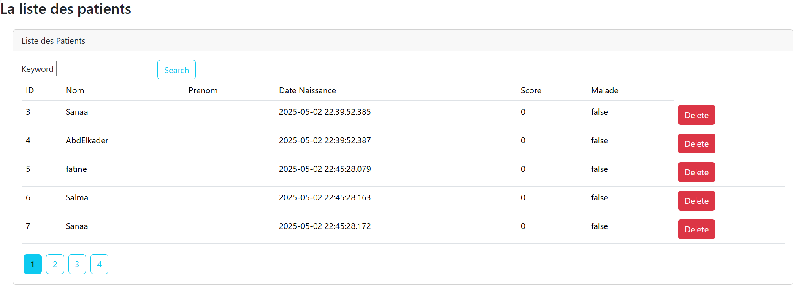

A# Application de gestion des patients

Cette application permet de gérer les patients dans un hôpital en utilisant l'architecture **Spring MVC**. Le rendu des vues est effectué côté serveur grâce au moteur de template **Thymeleaf**.

## Fonctionnalités principales

- **Gestion des patients** : Ajouter, modifier, supprimer et afficher les informations des patients.
- **Pagination** : Affichage des patients paginés pour une gestion plus facile des grandes listes.
- **Recherche** : Fonctionnalité de recherche des patients par nom ou prénom.

## Technologies utilisées

- **Spring MVC** : Pour l'architecture du backend.
- **Thymeleaf** : Moteur de template pour le rendu des pages HTML côté serveur.
- **Spring Data JPA** : Pour la gestion des données avec PostgreSQL (ou H2 pour le développement).
- **PostgreSQL** : Base de données relationnelle utilisée pour stocker les informations des patients.

## Structure du projet

1. **Controller** : Gère les requêtes HTTP et l'interaction avec les modèles.
2. **Model** : Entités représentant les données des patients (par exemple, `Patient`).
3. **Repository** : Interface pour la gestion des données des patients via Spring Data JPA.
4. **Vue (HTML avec Thymeleaf)** : Affichage des données et des formulaires à l'utilisateur.

